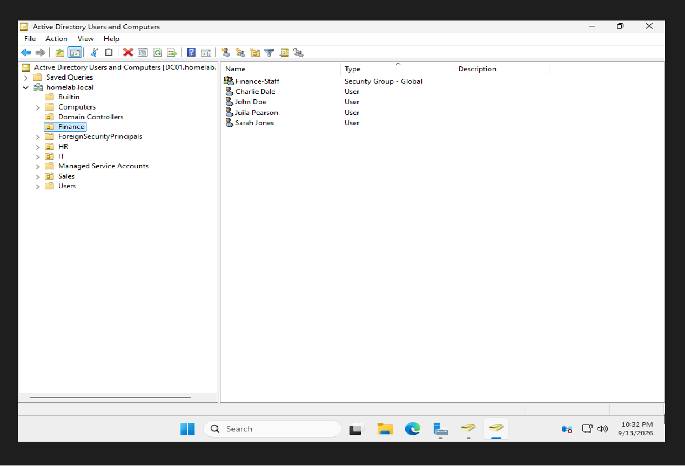
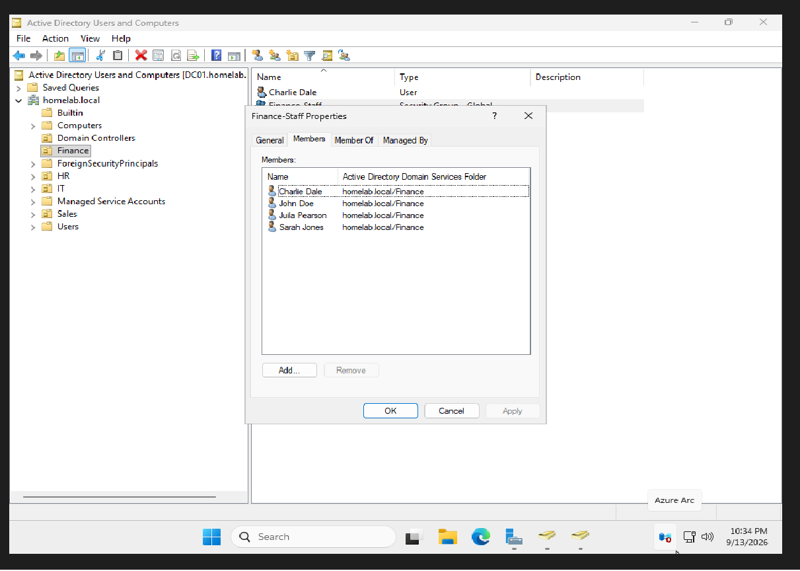
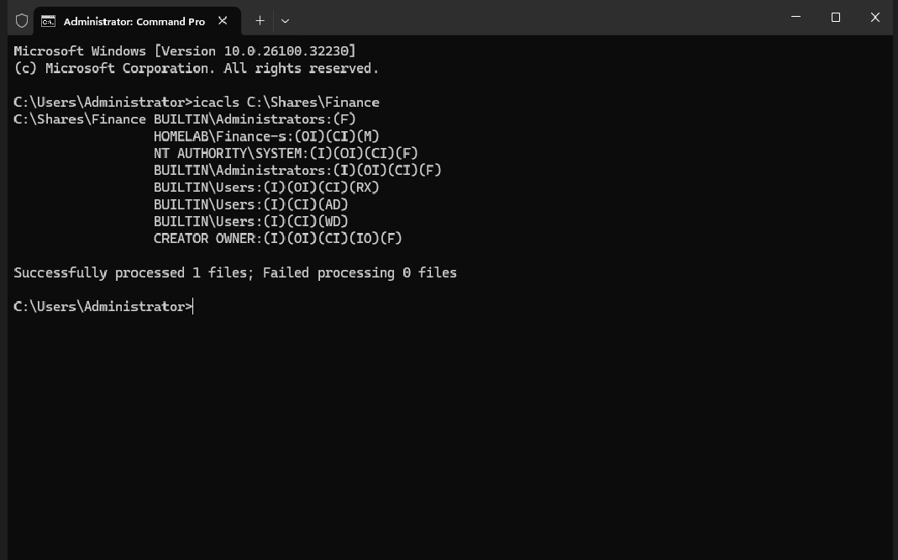
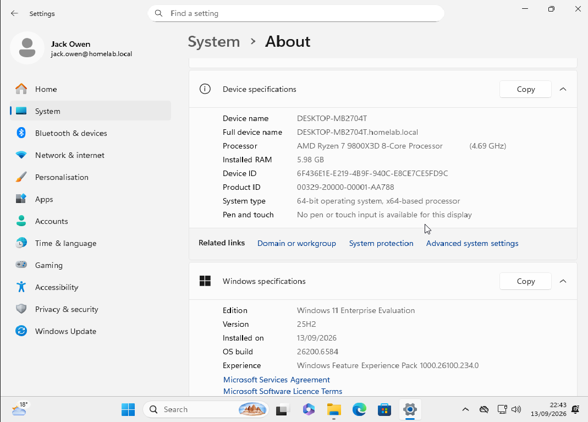
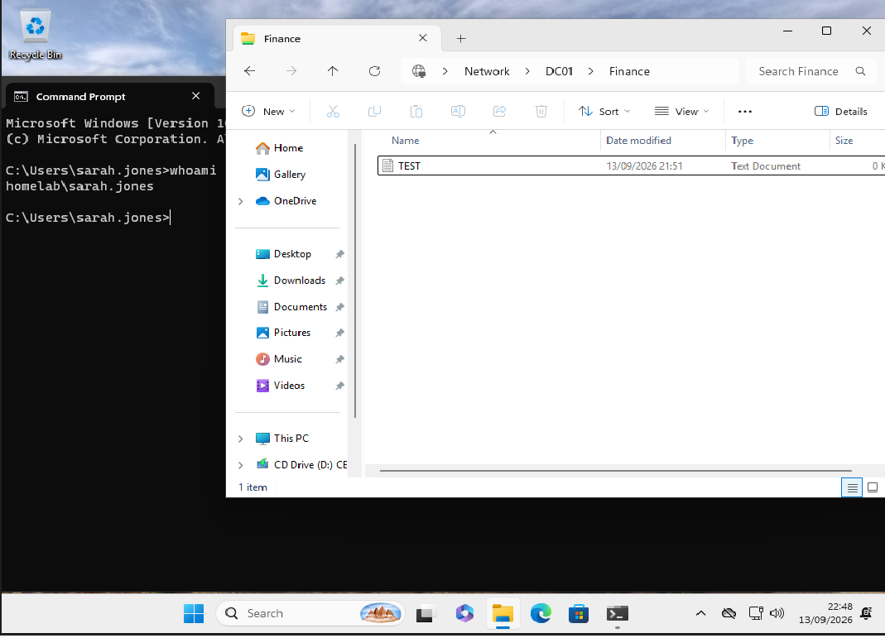
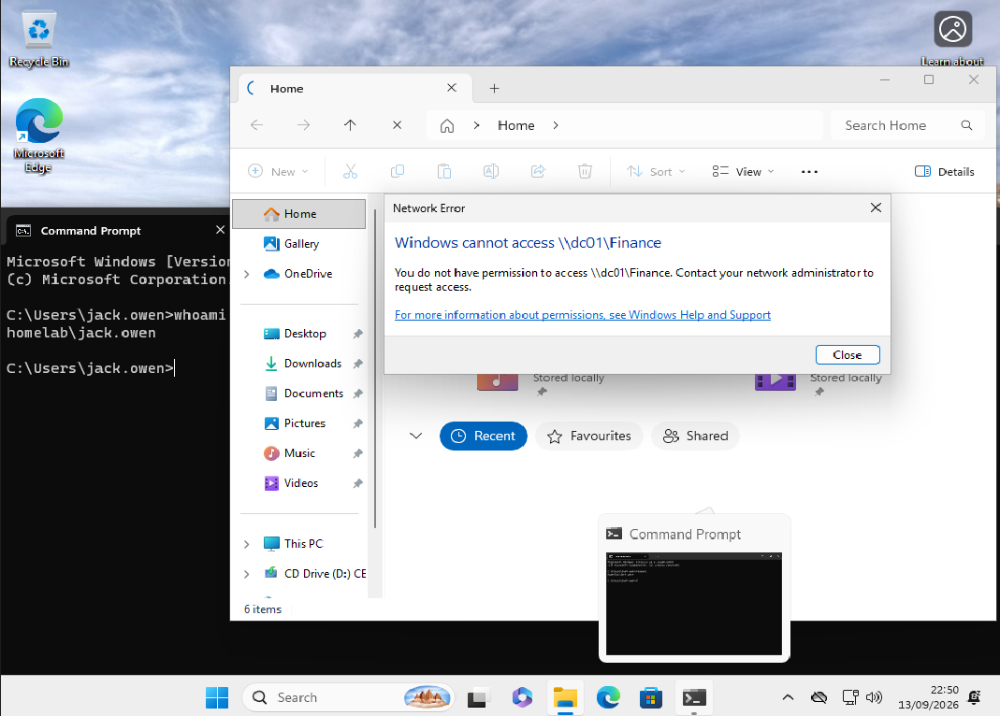

# Windows Active Directory Homelab

A self-directed project building a Windows Server 2025 Active Directory domain from scratch, joining a Windows 11 client to it, and demonstrating role-based access control on a file share.

Built to develop the Active Directory skills that appear in almost every 1st line support job advert. Everything below was done by hand on live machines rather than followed from a script, and the notes record the decisions and the mistakes as well as the result.

---

## Skills demonstrated

| Area | What I did |
|---|---|
| **Active Directory** | Domain controller promotion, forest creation, OUs, users, security groups |
| **DNS** | Configured a domain controller as its own DNS server; diagnosed name resolution from the client side |
| **Networking** | Static IP addressing, subnet masks, gateways, bridged virtual networking, connectivity testing |
| **Access control** | Share and NTFS permissions, group-based access, least privilege |
| **Client administration** | Windows 11 deployment, domain join, user profile creation, password resets |
| **Virtualisation** | VirtualBox VM provisioning, UEFI firmware, snapshots, multi-VM networking |

---

## Environment

```
        ┌──────────────────────────────┐
        │  DC01                        │
        │  Windows Server 2025         │
        │  192.168.1.50  (static)      │
        │  DNS → itself                │
        │                              │
        │  Domain: homelab.local       │
        │  Role:   AD DS + DNS         │
        │  Share:  C:\Shares\Finance   │
        └──────────────┬───────────────┘
                       │
              Bridged network
              192.168.1.0/24
                       │
        ┌──────────────┴───────────────┐
        │  WIN11-01                    │
        │  Windows 11 Enterprise       │
        │  192.168.1.70  (DHCP)        │
        │  DNS → 192.168.1.50          │
        │                              │
        │  Joined to homelab.local     │
        └──────────────────────────────┘
```

Host: Windows, 32 GB RAM, VirtualBox 7.2.16.

---

## 1. Building the domain controller

Installed Windows Server 2025 with the Desktop Experience, then configured it before promotion — deliberately in that order, because renaming a machine after it becomes a domain controller is significantly harder than renaming it before.

- Renamed to `DC01` and restarted
- Set the time zone correctly (see the Kerberos section for why this matters more than it looks)
- Switched the virtual adapter from NAT to **Bridged**, so the VM sits on the real LAN rather than in VirtualBox's private translation layer
- Assigned a **static IP**: `192.168.1.50`, mask `255.255.255.0`, gateway `192.168.1.1`
- Set **Preferred DNS to its own address**

Installed the **AD DS role only** — no other roles — and promoted the server to a domain controller in a new forest, `homelab.local`.

### Why DNS points at itself

Active Directory publishes service records in DNS that tell clients where the domain controller lives. The promotion installs DNS on the server and creates those records.

Windows warns that pointing a machine's DNS at itself is unusual. For an ordinary server it is. For a domain controller it's the only configuration that works — if it asked the router, nothing would know where the domain was.

### Why only one role

Four roles in the list begin with "Active Directory", and it's easy to tick more than intended. Adding Rights Management also pulls in IIS as a dependency.

Every additional role means more services, more open ports and more attack surface, on the single most security-sensitive machine on a network. A domain controller should run domain controller things and nothing else.

---

## 2. Directory structure



Created four OUs mirroring departments — **Finance, Sales, IT, HR** — with users and a security group in each.

**OUs rather than the default Users container**, because Group Policy can be linked to an OU and cannot be linked to a container. Control can also be delegated per-OU, so an HR manager could reset HR passwords without holding rights over the whole domain.

**Global security groups**, one per department. Security rather than Distribution, because only a security group can hold permissions — a distribution group is an email list and will look completely normal until the moment you try to grant it access to something.



Users follow a `first.last` logon convention. Accounts were created with a temporary password and **"user must change password at next logon"** set, so the administrator never knows the user's working password.

---

## 3. File share and permissions

Created `C:\Shares\Finance`, shared it, and granted access to the `Finance-Staff` **group** rather than to individual users.

| Layer | Permission |
|---|---|
| Share | Finance-Staff → Change (`Everyone` removed) |
| NTFS | Finance-Staff → Modify |



### Two permission systems, one folder

Share permissions apply only when the folder is reached over the network. NTFS permissions apply always, locally or remotely. **When both exist, the most restrictive wins.**

This is the cause of the classic "why can't they edit the file?" ticket — someone checks the Security tab, sees Modify, and can't work out what's wrong, because the restriction is on the other tab entirely.

### Modify, not Full Control

Full Control would let users change the permissions themselves and take ownership of files. Modify covers everything they actually need: read, edit, create, delete.

Least privilege — the same reasoning behind running a script under a limited service account rather than as root.

### Group, not user

If someone changes department, group membership is a single edit and access follows the role automatically. Individual permissions leave no list to work from: access has to be hunted across every folder, share and application, and some always gets missed. It's a standard finding in access reviews.

---

## 4. Joining the client

Installed Windows 11 Enterprise, set its **DNS to 192.168.1.50**, and confirmed name resolution *before* attempting the join:

```
ping 192.168.1.50        → 4 replies, 0% loss
nslookup homelab.local   → 192.168.1.50
```

Checking first turns "the domain join isn't working" into "the client can't resolve the domain" — a specific fault with a specific fix.



The join itself requires **domain administrator credentials**, not the credentials of the user who will sit at the machine. Joining creates a computer object in the directory; if any user could do it, anyone could attach an untrusted machine to the network and have the domain trust it.

---

## 5. Demonstrating access control

Logged in to the client as a **Finance** user. Opened `\\DC01\Finance` and created a file, confirming Modify permissions work end to end.



Logged out, logged in as a **Sales** user, and attempted the same path.



Same machine, same folder, same network. The only difference is group membership — which is precisely the point.

---

## Things that went wrong, and what they taught

**The install appeared to hang on a black screen.** It was actually at "Installing 0%" the whole time; the display wasn't refreshing. Forcing a restart would have corrupted a half-finished installation. Check for signs of life — CPU activity, disk activity — before assuming a crash.

**The boot prompt kept timing out**, dropping the VM into the UEFI firmware menu. Worth knowing that a machine which can't find a bootable OS falls back to firmware setup. When a user's laptop "won't start" and shows a screen like that, it usually means boot order or an undetected drive, not dead hardware.

**"An object named 'Jones' cannot be found."** Check Names matches on display name and logon name, not surname alone — but the more useful lesson is to read "Select this object type" before assuming the name is wrong. A dialog searching for Groups will never find a User, however correctly it's typed.

**Couldn't recall a user's password.** There is no way to look one up. Active Directory stores a hash, not the password, so a reset is the only option available to anyone including domain admins. That's why "can you just tell me my password?" is always answered with a reset.

---

## Kerberos and the clock

Active Directory authenticates with Kerberos, which compares timestamps between client and domain controller to prevent replay attacks. More than **five minutes** of drift and authentication fails outright.

Domain members sync their clock from the domain controller, so if the DC's time is wrong, everything downstream is wrong. Checking the time is a legitimate diagnostic step for domain login failures, and one that almost nobody expects.

---

## Verification commands

```
ipconfig /all                # static IP, and Primary DNS Suffix once joined
nslookup homelab.local       # does the client resolve the domain?
ping 192.168.1.50            # can the client reach the DC?
net share                    # does the share exist, and where?
icacls C:\Shares\Finance     # NTFS permissions — (M) = Modify
whoami                       # which account is this session actually running as?
```

Reading `icacls` output: `(OI)(CI)` means the permission inherits down to files and subfolders. `(I)` means the entry was inherited from the parent rather than set explicitly. When diagnosing "why can this person see this", explicit versus inherited is the first thing to establish.

---

## Next steps

- [ ] Link a Group Policy Object to an OU — password policy and desktop configuration
- [ ] Assign a static IPv6 address, or disable IPv6 on the domain controller
- [ ] Delegate control of an OU to demonstrate least-privilege administration
- [ ] Configure folder redirection for domain users
